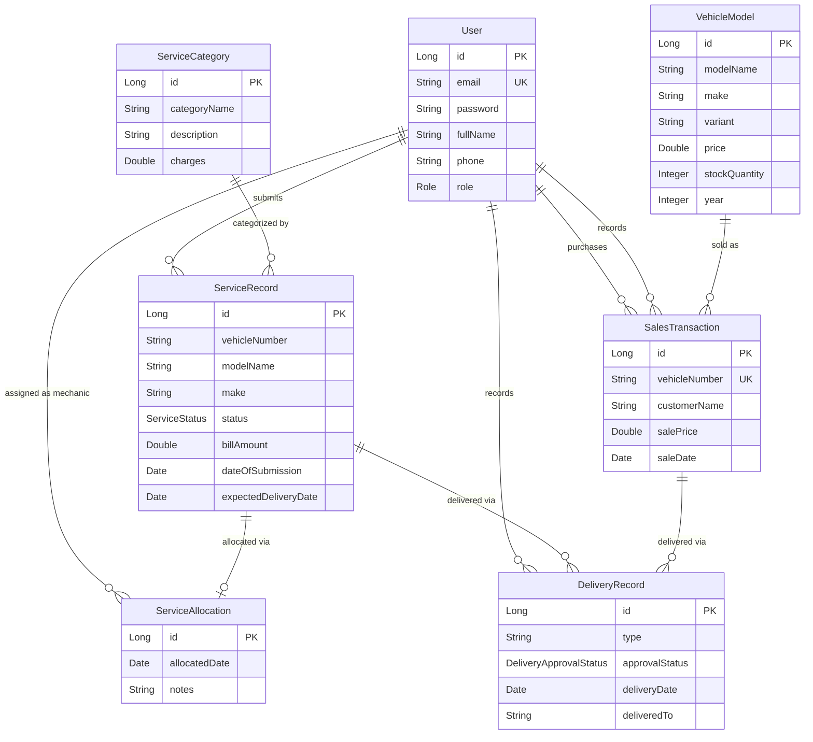

# E-AutoMerchandiser

A full-stack **2-Wheeler Showroom & Service Center Management System** built with **Spring Boot 3** and **React 19**. It provides role-based workflows for managing vehicle sales, servicing, delivery tracking, billing, and reporting across five user roles.

---

## Tech Stack

| Layer | Technology |
|---|---|
| **Frontend** | React 19, Vite 8, Tailwind CSS 4, React Router 7, Axios |
| **Backend** | Spring Boot 3.2.5, Spring Security, Spring Data JPA |
| **Database** | MySQL |
| **Auth** | Stateless JWT (HMAC-SHA, jjwt 0.12.5) |
| **Language** | Java 17, JavaScript (ES Modules) |
| **Build** | Maven (backend), npm/Vite (frontend) |

---

## Features by Role

### Manager
- Add new vehicle models and service categories
- Update vehicle prices and service charges
- View sales reports (monthly / half-yearly / annually, model-wise, make-wise)
- View service reports and mechanic-wise breakdown
- View revenue reports (sales & service revenue)

### Supervisor
- View vehicles submitted for service
- Allocate vehicles to mechanics
- Track real-time service status
- Approve or reject deliveries

### Clerk
- Upload/create service records for customer vehicles
- Record vehicle sales (auto stock decrement)
- Record delivery details (new vehicle / serviced vehicle)
- Generate service bills and sales bills

### Mechanic
- View allocated vehicles
- Update service status (`UNDER_SERVICING` → `SERVICED`)
- Update work description for each service

### Customer
- Track vehicle service status
- View purchase history

---

## Service Workflow

```
RECEIVED → ALLOCATED → UNDER_SERVICING → SERVICED → APPROVED_FOR_DELIVERY → DELIVERED
```

---

## Project Structure

```
E-AutoMerchendiser/
├── backend/                          # Spring Boot API
│   ├── pom.xml
│   └── src/main/java/com/bits/eautomerchandiser/
│       ├── EAutoMerchandiserApplication.java
│       ├── config/                   # Security, JWT, CORS, DataInitializer
│       ├── controller/               # REST controllers (per role)
│       ├── dto/                      # Request/Response DTOs
│       ├── exception/                # Exception handling
│       ├── model/                    # JPA entities
│       ├── repository/               # Spring Data repositories
│       └── service/                  # Business logic (AuthService)
│
├── frontend/                         # React SPA
│   ├── package.json
│   ├── vite.config.js
│   └── src/
│       ├── App.jsx                   # Route definitions
│       ├── api/axiosConfig.js        # Axios instance with JWT interceptor
│       ├── context/AuthContext.jsx    # Auth state management
│       ├── components/
│       │   ├── auth/                 # Login, Register forms
│       │   ├── manager/              # Manager dashboard components
│       │   ├── supervisor/           # Supervisor dashboard components
│       │   ├── clerk/                # Clerk dashboard components
│       │   ├── mechanic/             # Mechanic dashboard components
│       │   ├── customer/             # Customer dashboard components
│       │   └── common/               # Navbar, Sidebar, ProtectedRoute
│       └── pages/                    # Dashboard layout pages
│
└── README.md
```

---

## API Endpoints

### Auth — `/api/auth` (Public)
| Method | Endpoint | Description |
|---|---|---|
| POST | `/api/auth/login` | Login (returns JWT) |
| POST | `/api/auth/register` | Register new user |

### Manager — `/api/manager` (MANAGER only)
| Method | Endpoint | Description |
|---|---|---|
| GET | `/api/manager/vehicle-models` | List all vehicle models |
| POST | `/api/manager/vehicle-models` | Add vehicle model |
| PUT | `/api/manager/vehicle-models/{id}/price` | Update vehicle price |
| GET | `/api/manager/service-categories` | List service categories |
| POST | `/api/manager/service-categories` | Add service category |
| PUT | `/api/manager/service-categories/{id}/charges` | Update service charges |

### Supervisor — `/api/supervisor` (SUPERVISOR only)
| Method | Endpoint | Description |
|---|---|---|
| GET | `/api/supervisor/service-records` | List service records (filter by status) |
| GET | `/api/supervisor/mechanics` | List all mechanics |
| POST | `/api/supervisor/allocate` | Allocate vehicle to mechanic |
| GET | `/api/supervisor/service-status` | View service status with mechanic info |
| PUT | `/api/supervisor/approve/{id}` | Approve service for delivery |
| GET | `/api/supervisor/pending-deliveries` | List pending deliveries |
| PUT | `/api/supervisor/approve-delivery/{id}` | Approve delivery |
| PUT | `/api/supervisor/reject-delivery/{id}` | Reject delivery |

### Clerk — `/api/clerk` (CLERK only)
| Method | Endpoint | Description |
|---|---|---|
| POST | `/api/clerk/service-records` | Create service record |
| GET | `/api/clerk/service-records` | List service records |
| GET | `/api/clerk/service-records/{id}/bill` | Generate service bill |
| POST | `/api/clerk/sales` | Record vehicle sale |
| GET | `/api/clerk/sales` | List sales without deliveries |
| GET | `/api/clerk/sales/all` | List all sales |
| GET | `/api/clerk/sales/{id}/bill` | Generate sales bill |
| POST | `/api/clerk/deliveries` | Record delivery |
| GET | `/api/clerk/deliveries` | List all deliveries |
| GET | `/api/clerk/vehicle-models` | List vehicle models |
| GET | `/api/clerk/service-categories` | List service categories |
| GET | `/api/clerk/customers` | List customers |

### Mechanic — `/api/mechanic` (MECHANIC only)
| Method | Endpoint | Description |
|---|---|---|
| GET | `/api/mechanic/allocated` | View all allocated vehicles |
| GET | `/api/mechanic/active` | View active allocations |
| PUT | `/api/mechanic/service-records/{id}/status` | Update service status |
| PUT | `/api/mechanic/service-records/{id}/work-info` | Update work description |

### Customer — `/api/customer` (CUSTOMER only)
| Method | Endpoint | Description |
|---|---|---|
| GET | `/api/customer/vehicle-status` | View own service records |
| GET | `/api/customer/purchases` | View purchase history |

### Reports — `/api/reports` (MANAGER only)
| Method | Endpoint | Description |
|---|---|---|
| GET | `/api/reports/sales` | Sales report (monthly/half-yearly/annually) |
| GET | `/api/reports/sales/model-wise` | Sales by vehicle model |
| GET | `/api/reports/sales/make-wise` | Sales by make |
| GET | `/api/reports/services` | Service report by date range |
| GET | `/api/reports/revenue/sales` | Sales revenue |
| GET | `/api/reports/revenue/services` | Service revenue |
| GET | `/api/reports/mechanic-wise` | Service count per mechanic |

---

## Getting Started

### Prerequisites

- Java 17+
- Maven 3.8+
- Node.js 18+
- MySQL 8+

### Database Setup

```sql
CREATE DATABASE eautomerchandiser;
```

### Backend

```bash
cd backend

# Configure database connection in src/main/resources/application.properties:
# spring.datasource.url=jdbc:mysql://localhost:3306/eautomerchandiser
# spring.datasource.username=root
# spring.datasource.password=yourpassword
# jwt.secret=your-base64-encoded-secret
# jwt.expiration=86400000

mvn spring-boot:run
```

The backend starts on **http://localhost:8080**.

### Frontend

```bash
cd frontend
npm install
npm run dev
```

The frontend starts on **http://localhost:5173**.

---

## Seed Data

On first startup (when the users table is empty), the `DataInitializer` seeds the database with:

| Role | Email | Password |
|---|---|---|
| Manager | manager@auto.com | password123 |
| Supervisor | supervisor@auto.com | password123 |
| Clerk | clerk@auto.com | password123 |
| Mechanic | mechanic1@auto.com | password123 |
| Mechanic | mechanic2@auto.com | password123 |
| Customer | customer1@auto.com | password123 |
| Customer | customer2@auto.com | password123 |

Plus **12 vehicle models** (Honda, TVS, Bajaj, Hero, Yamaha, Suzuki, Royal Enfield) and **6 service categories** (General Service, Oil Change, Brake Repair, Engine Overhaul, Tire Replacement, Electrical Work).

---

## Data Model



---

## Security

- **Stateless JWT** authentication — no server-side sessions
- BCrypt password hashing
- Role-based URL authorization enforced at the Spring Security filter chain
- CSRF disabled (appropriate for stateless API)
- CORS configured for frontend dev server origins